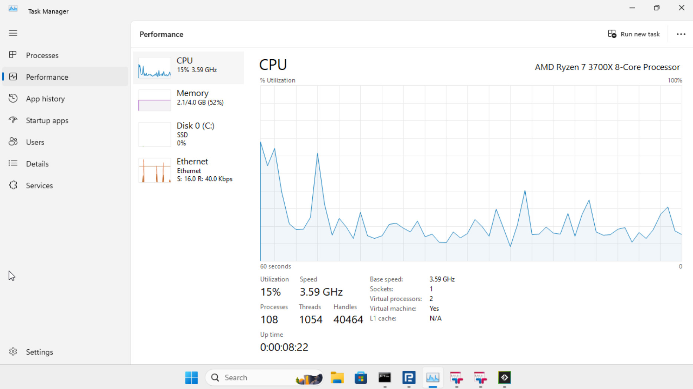

# mt5-httpapi

MetaTrader 5 running inside a real Windows VM (Docker + QEMU/KVM) with a REST API slapped on top for programmatic trading. No Wine bullshit, no janky workarounds - a legit Windows environment running the full MT5 terminal in portable mode.

Supports multiple brokers and multiple accounts on the same VM simultaneously. Each terminal gets its own Python API process inside the VM, and an always-on nginx sidecar fronts them all behind a single host port at `http://localhost:8888/<broker>/<account>/...`. Run two FTMO challenges at once, or mix brokers - whatever you need.

## ⚠️ Disclaimer

This is a tool for automating trades. If you blow your account, that's on you. Use demo accounts first, test your shit, and don't come crying when your algo buys the top.

## Recommended Brokers

- [RoboForex](https://my.roboforex.com/en/?a=zswg)
- [TeleTrade](https://my.teletrade-dj.com/agent_pp.html?agent_pp=26834897)

## Requirements

- Linux host with KVM enabled (`/dev/kvm`)
- Docker + Docker Compose
- ~20 GB disk (4 GB ISO + 11 GB VM + MT5 installs)
- 5 GB RAM (for the Windows VM)

The container ships with a `512M` memory limit and `5G` memswap limit — so the VM runs mostly on host swap. tiny11 + the debloat script idles at ~1.4 GB, MT5 + the Python API add a bit on top. For low-volume use (placing trades, polling positions, pulling small recent candle windows) this is fine — it's not latency-sensitive enough for swap to matter. noVNC is there so you can watch the installation progress; after that, forget the UI exists and just hit the REST API.

### When 512M is NOT enough

MT5 terminals cache every loaded chart in process RAM and never release it. The moment you start backfilling deep history (e.g. scraping all symbols × multiple timeframes × years of data) each terminal balloons to multi-GB. With a 512M container limit that all gets paged to host swap, Windows guest memory manager doesn't know the pages are on disk, processes appear unresponsive, and Windows starts trimming/killing them silently. The cmd.exe wrappers stay open but blank, the Python API processes are dead, and you get a hung tunnel.

If you're doing **heavy historical data scraping**, do at least one of:

- Bump the container memory limit to match real demand (4–8 GB for multi-terminal heavy scraping).
- Scrape one broker at a time (stop the others) so only one terminal accumulates cache.
- Restart the terminal between batches via `POST /terminal/restart` to flush the chart cache.
- Chunk time ranges instead of pulling 10 years of M1 in one shot.

Or just run MT5 on a dedicated box if you're hammering it.

### Real-world usage: 4 terminals on 2 vCPUs + 512M RAM (light load only)



4 MT5 terminals (RoboForex, 2x TeleTrade, FTMO) running simultaneously on 2 vCPUs with only 512M real RAM. CPU spikes to 100% during startup, drops to ~15% idle. Total memory usage: 2.1 GB, comfortably on swap. This works **as long as you're not stress-loading it with deep history scrapes** — at idle / light polling, you can pack 10+ terminals in here.

## Quick Start

```bash
# 1. Set up your broker account
cp config/accounts.json.example config/accounts.json
cp config/terminals.example.json config/terminals.json
# Edit both files with your broker credentials

# 2. Generate an API token (optional but recommended)
openssl rand -hex 32 > config/api_token.txt

# 3. Drop your broker's MT5 installer in mt5installers/
#    Name it: mt5setup-<broker>.exe
cp ~/Downloads/mt5setup.exe mt5installers/mt5setup-roboforex.exe

# 4. Fire it up
make up
```

First run downloads [tiny11](https://archive.org/details/tiny-11-NTDEV) (stripped-down Windows 11, ~4 GB), installs it (~10 min), then sets up Python + MT5 automatically. After that, boots in ~1 min. Go grab a coffee on the first run.

## Configuration

### `config/accounts.json`

Your broker credentials. Organized by broker, then account name:

```json
{
  "roboforex": {
    "main": {
      "login": 12345678,
      "password": "your_password",
      "server": "RoboForex-Pro"
    },
    "demo": {
      "login": 87654321,
      "password": "demo_password",
      "server": "RoboForex-Demo"
    }
  }
}
```

### `config/terminals.json`

Defines which terminals to run. Each entry gets its own MT5 terminal instance and its own API process on a dedicated port:

```json
[
  {
    "broker": "roboforex",
    "account": "main",
    "port": 6542,
    "utc_offset": "3h"
  },
  {
    "broker": "roboforex",
    "account": "demo",
    "port": 6543,
    "utc_offset": "3h"
  }
]
```

- `broker` — matches the installer name (`mt5setup-<broker>.exe`) and `accounts.json` key
- `account` — matches the account name in `accounts.json` under that broker
- `port` — container-internal port for this terminal's HTTP API (only nginx and the mt5 container talk to it; not exposed to the host)
- `utc_offset` — broker server's UTC offset, used to normalize all timestamps to real UTC on the wire (see [Broker time vs real UTC](#broker-time-vs-real-utc) below). Optional — defaults to `0` (no normalization). Accepts `"3h"`, `"3h30m"`, `"-2h"`, `"90m"`, or a bare number (interpreted as hours). Common values: RoboForex/FTMO `"3h"`, TeleTrade `"2h"`.

Each terminal installs to `<broker>/base/` and gets copied to `<broker>/<account>/` at startup so multiple accounts of the same broker don't step on each other.

### `config/api_token.txt`

Optional. If present, all API endpoints require `Authorization: Bearer <token>`. Without it, the API runs open with no auth.

```bash
openssl rand -hex 32 > config/api_token.txt
```

### `config/requirements.txt`

Extra Python packages you want in the VM. `MetaTrader5` and `flask` are already in there.

### `config/setup.bat`

Custom commands that run on every VM boot before MT5 starts. Shove whatever Windows setup shit you need in here.

### `mt5installers/`

Dump your broker MT5 installers here. Name them `mt5setup-<broker>.exe` and each one gets its own portable install automatically.

## API

All terminals are served behind a single host port via nginx. Default entry point: `http://localhost:8888` (loopback-only). Each terminal lives at its own path prefix:

```
http://localhost:8888/<broker>/<account>/...
```

Example: with a `roboforex/main` terminal in `terminals.json`, hit `http://localhost:8888/roboforex/main/ping`. The `/<broker>/<account>/` prefix is stripped by nginx and the rest is proxied to that terminal's API process inside the VM.

If `config/api_token.txt` is set, include the token on every request:

```bash
export MT5_API_TOKEN=$(cat config/api_token.txt)
curl -H "Authorization: Bearer $MT5_API_TOKEN" http://localhost:8888/roboforex/main/ping
```

### Health

| Method | Endpoint | Description       |
| ------ | -------- | ----------------- |
| GET    | `/ping`  | Is this thing on? |
| GET    | `/error` | Last MT5 error    |

**GET `/ping`**:

```json
{ "status": "ok" }
```

**GET `/error`**:

```json
{ "code": 1, "message": "Success" }
```

### Terminal

| Method | Endpoint             | Description               |
| ------ | -------------------- | ------------------------- |
| GET    | `/terminal`          | Terminal info             |
| POST   | `/terminal/init`     | Initialize MT5 connection |
| POST   | `/terminal/shutdown` | Kill MT5                  |

**GET `/terminal`**:

```json
{
  "build": 5602,
  "codepage": 0,
  "commondata_path": "C:\\Users\\Docker\\AppData\\Roaming\\MetaQuotes\\Terminal\\Common",
  "community_account": false,
  "community_balance": 0.0,
  "community_connection": false,
  "company": "Your Broker Inc.",
  "connected": true,
  "data_path": "C:\\Users\\Docker\\Desktop\\Shared\\mybroker",
  "dlls_allowed": true,
  "email_enabled": false,
  "ftp_enabled": false,
  "language": "English",
  "maxbars": 100000,
  "mqid": false,
  "name": "MyBroker MetaTrader 5",
  "notifications_enabled": false,
  "path": "C:\\Users\\Docker\\Desktop\\Shared\\mybroker",
  "ping_last": 0,
  "retransmission": 0.003,
  "trade_allowed": true,
  "tradeapi_disabled": false,
  "broker_utc_offset_hours": 3,
  "broker_utc_offset_seconds": 10800
}
```

**POST `/terminal/init`** and **POST `/terminal/shutdown`**:

```json
{ "success": true }
```

The API auto-initializes on first request. You almost never need to call these manually.

### Account

| Method | Endpoint   | Description          |
| ------ | ---------- | -------------------- |
| GET    | `/account` | Current account info |

**GET `/account`**:

```json
{
  "login": 12345678,
  "name": "Your Name",
  "server": "MyBroker-Server",
  "company": "Your Broker Inc.",
  "currency": "USD",
  "currency_digits": 2,
  "balance": 10000.0,
  "credit": 0.0,
  "profit": 0.0,
  "equity": 10000.0,
  "margin": 0.0,
  "margin_free": 10000.0,
  "margin_level": 0.0,
  "margin_initial": 0.0,
  "margin_maintenance": 0.0,
  "margin_so_call": 70.0,
  "margin_so_so": 20.0,
  "margin_so_mode": 0,
  "margin_mode": 2,
  "assets": 0.0,
  "liabilities": 0.0,
  "commission_blocked": 0.0,
  "leverage": 500,
  "limit_orders": 0,
  "trade_allowed": true,
  "trade_expert": true,
  "trade_mode": 0,
  "fifo_close": false
}
```

### Broker time vs real UTC

MT5 has a notorious timezone gotcha: every timestamp it returns (tick `time`, rate `time`, position `time`, deal `time_msc`, etc.) is the **broker server's wall-clock time**, encoded as a unix integer. Looks like UTC, isn't. RoboForex/FTMO run UTC+3, TeleTrade UTC+2 — so a tick captured at real UTC `22:57` reports as unix `01:57` (3h ahead) on RoboForex, `00:57` (2h ahead) on TeleTrade.

The MT5 Python SDK doesn't expose `TimeCurrent()` / `TimeGMT()`, so the API can't auto-detect this. Instead, set `utc_offset` per terminal in `terminals.json`:

```json
{ "broker": "roboforex", "account": "main", "port": 6542, "utc_offset": "3h" }
```

When set, the API:
- Subtracts the offset from every outgoing timestamp (tick time, rate time, position/order/deal times, `_msc` fields), so responses are real UTC unix.
- Adds the offset to incoming `from`/`to` query params, so callers always pass real UTC unix and get back real UTC unix.

Inspect via `GET /terminal` — fields `broker_utc_offset_hours` and `broker_utc_offset_seconds` show what's in effect.

If `utc_offset` is omitted (or `0`), the API passes raw broker timestamps through unchanged (pre-1.8 behavior).

### Symbols

| Method | Endpoint                 | Description                               |
| ------ | ------------------------ | ----------------------------------------- |
| GET    | `/symbols`               | List symbols (`?group=*USD*`)             |
| GET    | `/symbols/:symbol`       | Symbol details                            |
| GET    | `/symbols/:symbol/tick`  | Latest tick                               |
| GET    | `/symbols/:symbol/rates` | OHLCV candles (`?timeframe=H1&count=100`, `?timeframe=H1&from=<unix>&count=-100`, or `?timeframe=H1&from=<unix>&to=<unix>`) |
| GET    | `/symbols/:symbol/ticks` | Tick data (`?count=100`, `?from=<unix>&count=-100`, or `?from=<unix>&to=<unix>`)                                            |

**GET `/symbols`** — array of symbol names:

```json
["EURUSD", "GBPUSD", "ADAUSD", "BTCUSD", "..."]
```

**GET `/symbols/:symbol`** — full symbol info:

```json
{
    "name": "EURUSD",
    "description": "Euro vs US Dollar",
    "path": "Markets\\Forex\\Major\\EURUSD",
    "currency_base": "EUR",
    "currency_profit": "USD",
    "currency_margin": "EUR",
    "digits": 5,
    "point": 1e-05,
    "spread": 30,
    "spread_float": true,
    "trade_contract_size": 100000.0,
    "trade_tick_size": 1e-05,
    "trade_tick_value": 1.0,
    "trade_tick_value_profit": 1.0,
    "trade_tick_value_loss": 1.0,
    "volume_min": 0.01,
    "volume_max": 100.0,
    "volume_step": 0.01,
    "volume_limit": 0.0,
    "trade_mode": 4,
    "trade_calc_mode": 0,
    "trade_exemode": 2,
    "trade_stops_level": 1,
    "trade_freeze_level": 0,
    "swap_long": -11.0,
    "swap_short": 1.14064,
    "swap_mode": 1,
    "swap_rollover3days": 3,
    "margin_initial": 0.0,
    "margin_maintenance": 0.0,
    "margin_hedged": 50000.0,
    "filling_mode": 3,
    "expiration_mode": 15,
    "order_gtc_mode": 0,
    "order_mode": 127,
    "bid": 1.18672,
    "ask": 1.18702,
    "bidhigh": 1.18845,
    "bidlow": 1.1847,
    "askhigh": 1.1885,
    "asklow": 1.18475,
    "last": 0.0,
    "time": 1771027139,
    "select": true,
    "visible": true,
    "custom": false,
    "session_deals": 0,
    "session_buy_orders": 0,
    "session_sell_orders": 0,
    "session_open": 1.1869,
    "session_close": 1.18698,
    "price_change": -0.0219,
    "bank": "",
    "basis": "",
    "category": "",
    "exchange": "",
    "isin": "",
    "..."
}
```

There's a shitload of fields — these are the ones you'll actually use:

| Field                                     | What it is                                 |
| ----------------------------------------- | ------------------------------------------ |
| `bid`, `ask`                              | Current prices                             |
| `digits`                                  | Price decimal places                       |
| `point`                                   | Smallest price change                      |
| `trade_tick_size`                         | Minimum price movement                     |
| `trade_tick_value`                        | Profit/loss per tick per 1 lot             |
| `trade_contract_size`                     | Contract size (100000 for forex)           |
| `volume_min`, `volume_max`, `volume_step` | Lot size constraints                       |
| `spread`                                  | Current spread in points                   |
| `swap_long`, `swap_short`                 | Overnight swap rates                       |
| `trade_stops_level`                       | Min distance for SL/TP from price (points) |

**GET `/symbols/:symbol/tick`**:

```json
{
  "time": 1771150549,
  "bid": 0.3001,
  "ask": 0.3004,
  "last": 0.0,
  "volume": 0,
  "time_msc": 1771150549145,
  "flags": 1030,
  "volume_real": 0.0
}
```

**GET `/symbols/:symbol/rates`** — array of OHLCV candles:

Timeframes: `M1` `M2` `M3` `M4` `M5` `M6` `M10` `M12` `M15` `M20` `M30` `H1` `H2` `H3` `H4` `H6` `H8` `H12` `D1` `W1` `MN1`

```json
{
  "time": 1771128000,
  "open": 0.2962,
  "high": 0.3006,
  "low": 0.2922,
  "close": 0.2979,
  "tick_volume": 4755,
  "spread": 30,
  "real_volume": 0
}
```

`time` is the candle open time, unix epoch seconds.

Query params (rates):

| Param | Behavior |
| --- | --- |
| `timeframe` | Defaults `M1` |
| `count` | Signed integer (default `100`). Positive = N forward from `from` (or last N if no `from`). Negative = `\|N\|` ending at `from`. Zero = empty result. Mutually exclusive with `to`. |
| `from` | Anchor (real UTC). Omitted = now. Accepts unix seconds, `YYYY_MM_DD_HH_MM_SS`, or `YYYY_MM_DD` (midnight UTC). |
| `to` | Range end (real UTC, same formats as `from`). Requires `from`. Returns all bars in `[from, to]`, no count cap beyond `terminal_info().maxbars`. Mutually exclusive with `count`. |

Examples:
- `?timeframe=H1&count=100` — last 100 H1 candles up to current bar
- `?timeframe=H1&from=1700000000&count=100` — 100 candles forward from anchor
- `?timeframe=H1&from=2024_01_15&count=-100` — 100 candles ending at midnight UTC on 2024-01-15
- `?timeframe=H1&from=2024_01_15_09_30_00&to=2024_01_15_16_00_00` — every H1 candle in the window

Pick the mode that fits: `count` when you want exactly N bars and don't care about the end time; `to` when you have an explicit window and want everything in it. The `count` mode internally computes the range with weekend/holiday padding; the `to` mode is a direct passthrough to `copy_rates_range`.

**MaxBars cap:** MT5 returns at most `terminal_info().maxbars` rows per request (default 100,000 — visible at `GET /terminal`). For long backfills (e.g. M1 over a year ≈ 525k bars) chunk the time range client-side and stitch the results.

Symbols are auto-selected into MarketWatch on first access — backfilling rarely-traded instruments works without a manual select step.

**GET `/symbols/:symbol/ticks`** — array of ticks:

```json
{
  "time": 1771146325,
  "bid": 0.2973,
  "ask": 0.2976,
  "last": 0.0,
  "volume": 0,
  "time_msc": 1771146325123,
  "flags": 6,
  "volume_real": 0.0
}
```

Query params (ticks): same `count` / `from` / `to` model as rates — positive `count` = forward from `from`, negative = backward, `from+to` = range, `count` and `to` mutually exclusive, `to` requires `from`. Plus:

| Param | Values | Default | Meaning |
| --- | --- | --- | --- |
| `flags` | `ALL`, `INFO`, `TRADE` | `ALL` | `INFO` = bid/ask changes only (~10× smaller payload), `TRADE` = trades only, `ALL` = everything |

Examples:
- `?count=100` — last 100 ticks up to now
- `?from=2024_01_15_14_30_00&count=500` — 500 ticks forward from that timestamp
- `?from=1700000000&count=-500` — 500 ticks ending at anchor
- `?from=2024_01_15_09_00_00&to=2024_01_15_10_00_00` — every tick in that 1-hour window

Tick-density caveat: liquid pairs (EURUSD in NY hours) emit 10–100 ticks/sec. A 1-hour `from+to` window can return millions of rows. Prefer `count` mode unless you really need every tick in a window — and even then, keep the window small or paginate.

Responses are gzip-compressed when the client sends `Accept-Encoding: gzip` — typically a 5–10× bandwidth reduction for large rate/tick fetches. `curl` honors this if you pass `--compressed`.

### Positions

| Method | Endpoint             | Description                      |
| ------ | -------------------- | -------------------------------- |
| GET    | `/positions`         | List open positions (`?symbol=`) |
| GET    | `/positions/:ticket` | Get position                     |
| PUT    | `/positions/:ticket` | Update SL/TP                     |
| DELETE | `/positions/:ticket` | Close position                   |

**GET `/positions`** — array of position objects:

```json
{
  "ticket": 42094820,
  "time": 1771150554,
  "time_msc": 1771150554509,
  "time_update": 1771150554,
  "time_update_msc": 1771150554509,
  "type": 0,
  "magic": 0,
  "identifier": 42094820,
  "reason": 3,
  "volume": 100.0,
  "price_open": 0.3005,
  "sl": 0.28,
  "tp": 0.32,
  "price_current": 0.3003,
  "swap": 0.0,
  "profit": -0.02,
  "symbol": "ADAUSD",
  "comment": "",
  "external_id": ""
}
```

`type` 0 = buy, 1 = sell. `profit` is unrealized P&L.

**PUT `/positions/:ticket`** — move your stop loss / take profit:

```json
{
  "sl": 0.27,
  "tp": 0.36
}
```

**DELETE `/positions/:ticket`** — close that shit:

```json
{
  "volume": 500,
  "deviation": 20
}
```

All fields optional. `volume` defaults to full position, `deviation` defaults to 20.

### Orders

| Method | Endpoint          | Description                      |
| ------ | ----------------- | -------------------------------- |
| GET    | `/orders`         | List pending orders (`?symbol=`) |
| POST   | `/orders`         | Place an order                   |
| GET    | `/orders/:ticket` | Get order                        |
| PUT    | `/orders/:ticket` | Modify order                     |
| DELETE | `/orders/:ticket` | Cancel order                     |

**GET `/orders`** — array of pending order objects:

```json
{
  "ticket": 42094812,
  "time_setup": 1771147800,
  "time_setup_msc": 1771147800123,
  "time_done": 0,
  "time_done_msc": 0,
  "time_expiration": 0,
  "type": 2,
  "type_time": 0,
  "type_filling": 1,
  "state": 1,
  "magic": 0,
  "position_id": 0,
  "position_by_id": 0,
  "reason": 3,
  "volume_initial": 1000.0,
  "volume_current": 1000.0,
  "price_open": 0.28,
  "sl": 0.25,
  "tp": 0.35,
  "price_current": 0.2989,
  "price_stoplimit": 0.0,
  "symbol": "ADAUSD",
  "comment": "",
  "external_id": ""
}
```

`type`: 0=BUY, 1=SELL, 2=BUY_LIMIT, 3=SELL_LIMIT, 4=BUY_STOP, 5=SELL_STOP. `state`: 1=placed, 2=canceled, 3=partial, 4=filled, 5=rejected, 6=expired.

**POST `/orders`** — send it:

```json
{
  "symbol": "ADAUSD",
  "type": "BUY",
  "volume": 1000,
  "price": 0.28,
  "sl": 0.25,
  "tp": 0.35,
  "deviation": 20,
  "magic": 0,
  "comment": "",
  "type_filling": "IOC",
  "type_time": "GTC"
}
```

Required: `symbol`, `type`, `volume`. Everything else is optional. `price` gets auto-filled for market orders.

Order types:

- Market: `BUY`, `SELL`
- Pending: `BUY_LIMIT`, `SELL_LIMIT`, `BUY_STOP`, `SELL_STOP`, `BUY_STOP_LIMIT`, `SELL_STOP_LIMIT`

Fill policies: `FOK`, `IOC` (default), `RETURN`

Expiration types: `GTC` (default), `DAY`, `SPECIFIED`, `SPECIFIED_DAY`

**PUT `/orders/:ticket`** — change your mind on a pending order:

```json
{
  "price": 0.29,
  "sl": 0.26,
  "tp": 0.36,
  "type_time": "GTC"
}
```

All fields optional.

### Trade Result

What comes back from POST/PUT/DELETE on orders and positions:

```json
{
  "retcode": 10009,
  "deal": 40536203,
  "order": 42094820,
  "volume": 100.0,
  "price": 0.3005,
  "bid": 0.3002,
  "ask": 0.3005,
  "comment": "Request executed",
  "request_id": 1549268253,
  "retcode_external": 0
}
```

`retcode` 10009 = you're good. Anything else = something went wrong.

### History

| Method | Endpoint          | Description                      |
| ------ | ----------------- | -------------------------------- |
| GET    | `/history/orders` | Order history (`?from=TS&to=TS`) |
| GET    | `/history/deals`  | Deal history (`?from=TS&to=TS`)  |

`from` and `to` are required, unix epoch seconds.

**History order object** (completed/cancelled orders):

```json
{
  "ticket": 42094820,
  "time_setup": 1771150554,
  "time_setup_msc": 1771150554509,
  "time_done": 1771150554,
  "time_done_msc": 1771150554509,
  "time_expiration": 0,
  "type": 0,
  "type_time": 0,
  "type_filling": 1,
  "state": 4,
  "magic": 0,
  "position_id": 42094820,
  "position_by_id": 0,
  "reason": 3,
  "volume_initial": 100.0,
  "volume_current": 0.0,
  "price_open": 0.3005,
  "sl": 0.28,
  "tp": 0.32,
  "price_current": 0.3005,
  "price_stoplimit": 0.0,
  "symbol": "ADAUSD",
  "comment": "Request executed",
  "external_id": ""
}
```

`state` 4 = filled, 2 = canceled, 5 = rejected, 6 = expired. `volume_current` 0 = fully filled.

**Deal object** (actual executed trades):

```json
{
  "ticket": 40536203,
  "order": 42094820,
  "time": 1771150554,
  "time_msc": 1771150554509,
  "type": 0,
  "entry": 0,
  "position_id": 42094820,
  "symbol": "ADAUSD",
  "volume": 100.0,
  "price": 0.3005,
  "commission": 0.0,
  "swap": 0.0,
  "profit": 0.0,
  "fee": 0.0,
  "magic": 0,
  "reason": 3,
  "comment": "",
  "external_id": ""
}
```

`type`: 0 = buy, 1 = sell. `entry`: 0 = opening, 1 = closing. `profit` is 0 for entries, actual realized P&L for exits.

## Examples

```bash
export MT5_API_URL=http://localhost:8888/roboforex/main
export MT5_API_TOKEN=$(cat config/api_token.txt)  # omit if no auth configured

# Check your balance
curl -H "Authorization: Bearer $MT5_API_TOKEN" $MT5_API_URL/account

# Grab some EURUSD H4 candles
curl -H "Authorization: Bearer $MT5_API_TOKEN" "$MT5_API_URL/symbols/EURUSD/rates?timeframe=H4&count=100"

# YOLO 1000 ADAUSD with SL and TP
curl -X POST -H "Authorization: Bearer $MT5_API_TOKEN" $MT5_API_URL/orders \
  -H "Content-Type: application/json" \
  -d '{"symbol": "ADAUSD", "type": "BUY", "volume": 1000, "sl": 0.25, "tp": 0.35}'

# Place a pending buy limit
curl -X POST -H "Authorization: Bearer $MT5_API_TOKEN" $MT5_API_URL/orders \
  -H "Content-Type: application/json" \
  -d '{"symbol": "ADAUSD", "type": "BUY_LIMIT", "volume": 1000, "price": 0.28, "sl": 0.25, "tp": 0.35}'

# Move your SL and TP
curl -X PUT -H "Authorization: Bearer $MT5_API_TOKEN" $MT5_API_URL/positions/12345 \
  -H "Content-Type: application/json" \
  -d '{"sl": 0.27, "tp": 0.36}'

# Close half
curl -X DELETE -H "Authorization: Bearer $MT5_API_TOKEN" $MT5_API_URL/positions/12345 \
  -H "Content-Type: application/json" \
  -d '{"volume": 500}'

# Close everything
curl -X DELETE -H "Authorization: Bearer $MT5_API_TOKEN" $MT5_API_URL/positions/12345

# Hit different terminals when running multi-terminal
curl -H "Authorization: Bearer $MT5_API_TOKEN" http://localhost:8888/roboforex/main/account
curl -H "Authorization: Bearer $MT5_API_TOKEN" http://localhost:8888/ftmo/challenge1/account

# Get deal history for the last 24h
curl -H "Authorization: Bearer $MT5_API_TOKEN" "$MT5_API_URL/history/deals?from=$(date -d '1 day ago' +%s)&to=$(date +%s)"
```

## Go Client

A typed Go client lives in [`clients/go/`](clients/go/). All endpoints are covered, errors map to typed sentinels, and structs have been verified against live responses.

```bash
go get github.com/psyb0t/mt5-httpapi/clients/go
```

```go
package main

import (
	"context"
	"errors"
	"log"
	"os"
	"time"

	mt5 "github.com/psyb0t/mt5-httpapi/clients/go"
	"github.com/psyb0t/aichteeteapee"
)

func main() {
	c, err := mt5.New(mt5.Config{
		BaseURL: os.Getenv("MT5_API_URL"),
		Token:   os.Getenv("MT5_API_TOKEN"), // empty string if server has no auth
		Timeout: 30 * time.Second,
	})
	if err != nil {
		log.Fatal(err)
	}

	ctx := context.Background()

	acc, err := c.GetAccount(ctx)
	if errors.Is(err, mt5.ErrNotInitialized) {
		log.Fatal("MT5 still booting, retry in a sec")
	}
	if errors.Is(err, aichteeteapee.ErrUnauthorized) {
		log.Fatal("bad token")
	}
	if err != nil {
		log.Fatal(err)
	}
	log.Printf("balance=%.2f %s leverage=1:%d", acc.Balance, acc.Currency, acc.Leverage)

	// Place a market buy
	res, err := c.CreateOrder(ctx, &mt5.CreateOrderRequest{
		Symbol: "EURUSD",
		Type:   "BUY",
		Volume: 0.1,
		SL:     1.08,
		TP:     1.10,
	})
	if err != nil {
		log.Fatal(err)
	}
	log.Printf("retcode=%d order=%d deal=%d price=%.5f", res.Retcode, res.Order, res.Deal, res.Price)

	// Pull H4 candles
	rates, err := c.GetRates(ctx, "EURUSD", mt5.RatesQuery{Timeframe: "H4", Count: 100})
	if err != nil {
		log.Fatal(err)
	}
	log.Printf("got %d candles, last close=%.5f", len(rates), rates[len(rates)-1].Close)
}
```

### Available methods

| Method | Endpoint |
| --- | --- |
| `Ping` | `GET /ping` |
| `LastError` | `GET /error` |
| `GetTerminal` / `InitTerminal` / `ShutdownTerminal` / `RestartTerminal` | `/terminal[/...]` |
| `GetAccount` | `GET /account` |
| `ListSymbols` / `GetSymbol` / `GetTick` / `GetRates` / `GetTicks` | `/symbols[/...]` |
| `ListOrders` / `CreateOrder` / `GetOrder` / `UpdateOrder` / `CancelOrder` | `/orders[/...]` |
| `ListPositions` / `GetPosition` / `UpdatePosition` / `ClosePosition` | `/positions[/...]` |
| `HistoryOrders` / `HistoryDeals` | `/history/...` |

### Error mapping

HTTP status maps to typed errors you can `errors.Is()` against:

| Status | Error |
| --- | --- |
| 400 | `aichteeteapee.ErrBadRequest` |
| 401 | `aichteeteapee.ErrUnauthorized` |
| 403 | `aichteeteapee.ErrForbidden` |
| 404 | `aichteeteapee.ErrNotFound` |
| 409 | `aichteeteapee.ErrConflict` |
| 422 | `aichteeteapee.ErrUnprocessableEntity` |
| 429 | `aichteeteapee.ErrTooManyRequests` |
| 500 | `aichteeteapee.ErrInternalServer` |
| 502 | `aichteeteapee.ErrBadGateway` |
| 503 | `mt5httpapi.ErrNotInitialized` (MT5 still booting) |
| 504 | `aichteeteapee.ErrGatewayTimeout` |

Helper: `mt5httpapi.IsNotInitialized(err)` shortcuts the common 503 retry case.

## Technical Analysis

The API gives you raw market data — it doesn't do TA. If you need indicators, grab the candles from here and crunch them yourself. There's a full working example in `examples/python/` using [pandas-ta](https://github.com/twopirllc/pandas-ta) with ATR, RSI, MACD, Bollinger Bands, MFI, Stochastic, ADX, VWAP, and moving averages.

```bash
cd examples/python
pip install -r requirements.txt

# Default: EURUSD H4 200 candles
python ta.py

# Custom symbol/timeframe/count
python ta.py BTCUSD H1 100
python ta.py ADAUSD D1 200

# Custom API URL
MT5_API_URL=http://10.0.0.5:8888/roboforex/main python ta.py EURUSD D1

# Candlestick chart with TA overlays (1920x1080 PNG)
python chart.py ADAUSD
python chart.py BTCUSD H1 100
python chart.py EURUSD D1 200 -o eurusd.png
```

Check out `indicators.py` for the individual indicator functions and `signals.py` for signal detection. Use them as building blocks for your own shit.

## Make Targets

```
make up          Fire up the VM (downloads ISO if needed)
make down        Shut it down
make logs        Tail the logs
make status      Check VM and API status
make clean       Nuke VM disk and state (keeps ISO)
make distclean   Nuke everything including ISO
```

## Ports

| Port  | Service                 | Override                          |
| ----- | ----------------------- | --------------------------------- |
| 8006  | noVNC (VM desktop)      | `NOVNC_PORT=9006 make up`         |
| 8888  | HTTP API (nginx, all terminals) | `API_HOST_PORT=9999 make up` |

Only two ports leave the docker network. Per-terminal ports from `config/terminals.json` stay container-internal — nginx (always-on, generated from `terminals.json`) routes `/<broker>/<account>/...` to the right terminal via docker DNS, and the mt5 container's iptables DNAT forwards from there into the Windows VM. The host bind is loopback-only (`127.0.0.1:8888`) by default; change the bind in `docker-compose.yml` if you want LAN exposure, or use the Tailscale sidecar below for tailnet exposure.

## Tailscale (optional)

Expose the API over your tailnet using a bare MagicDNS hostname — `http://mt5-httpapi/<broker>/<account>/...` — works with both stock Tailscale and self-hosted Headscale. Plain HTTP (no TLS) by design: bare hostnames don't have matching certs, and the wireguard layer already encrypts everything inside the tailnet.

How it works: a `tailscale` sidecar joins the tailnet in its **own netns** (bridge mode, not host net) so it gets its own tailnet identity — ACLs scope to the sidecar's node only, and the host's tailscale (if any) stays clean. Tailscale Serve listens on port 80 inside that netns and proxies to the always-on `nginx` sidecar (`http://nginx:80`) over docker's internal network. nginx then strips `/<broker>/<account>/` and proxies to the right terminal via docker DNS. `nginx.conf` is auto-generated from `config/terminals.json` on every `make up`; the Tailscale Serve config is wired in via the `tailscale serve` CLI from inside the sidecar (it needs the live FQDN, which only the CLI knows) and persisted in tailscaled state.

**Setup**:

1. Drop your auth key in `config/ts_authkey.txt` (gitignored):
   ```bash
   echo "tskey-auth-..." > config/ts_authkey.txt
   ```
   For Headscale, also drop the login server URL in `config/ts_login_server.txt`:
   ```bash
   echo "https://headscale.your.domain" > config/ts_login_server.txt
   ```

2. Uncomment the `tailscale` block in `docker-compose.yml`. (nginx is always on — no need to uncomment anything for it.)

3. `make up`. `run.sh` reads the config files, writes `TS_AUTHKEY` (and `TS_EXTRA_ARGS=--login-server=...` if Headscale) to `.env`, brings the stack up, waits for tailscaled to authenticate, and runs `tailscale serve --bg --http=80 http://nginx:80` inside the sidecar to wire the tailnet :80 listener to nginx. The Serve config persists in `.data/tailscale/state`, so subsequent `make up` calls don't need to redo it.

**State persistence**: tailnet identity lives in `.data/tailscale/state/`. `make down`/`make up` reuses the existing login — `TS_AUTHKEY` is consumed only on first auth (or after `rm -rf .data/tailscale/state`). Use a reusable auth key if you expect to wipe state.

**Multi-terminal URL scheme**:
```
http://mt5-httpapi/roboforex/main/account
http://mt5-httpapi/roboforex/main/symbols/EURUSD/rates?count=100
http://mt5-httpapi/ftmo/challenge1/positions
```

The API token (if set in `config/api_token.txt`) still applies — Tailscale handles network-level access, the token handles application-level auth.

## Cloudflare Tunnel (optional)

Expose the API publicly without opening firewall ports. cloudflared dials out to Cloudflare's edge and proxies to the always-on `nginx` sidecar — one tunnel, one hostname, every terminal reachable behind `/<broker>/<account>/`.

**Setup**:

1. Install cloudflared on the host (one-off, only needed to create the tunnel):
   ```bash
   curl -L https://github.com/cloudflare/cloudflared/releases/latest/download/cloudflared-linux-amd64 -o /tmp/cloudflared
   sudo install /tmp/cloudflared /usr/local/bin/cloudflared
   ```

2. Authenticate, create a tunnel, and route a single hostname to it (must be a zone you control on Cloudflare):
   ```bash
   cloudflared tunnel login
   cloudflared tunnel create mt5-httpapi
   cloudflared tunnel route dns mt5-httpapi mt5-api.yourdomain.com
   ```

3. Drop the credentials and config into `.data/cloudflared/`:
   ```bash
   mkdir -p .data/cloudflared
   cp ~/.cloudflared/<tunnel-id>.json .data/cloudflared/creds.json
   ```

   Create `.data/cloudflared/config.yml`:
   ```yaml
   tunnel: <tunnel-id>
   credentials-file: /etc/cloudflared/creds.json

   ingress:
     - hostname: mt5-api.yourdomain.com
       service: http://nginx:80
     - service: http_status:404
   ```

4. Uncomment the `cloudflared` block in `docker-compose.yml` and `make up`.

**Public URL scheme**:
```
https://mt5-api.yourdomain.com/roboforex/main/account
https://mt5-api.yourdomain.com/ftmo/challenge1/positions
```

Cloudflare terminates TLS at the edge — you get HTTPS for free without managing certs. The connection from cloudflared to `nginx:80` is plain HTTP over the docker bridge, but it never leaves the host.

**Subdomain depth**: Cloudflare's free Universal SSL covers `*.yourdomain.com` but not deeper levels like `*.mt5.yourdomain.com`. Use a single subdomain directly under the root domain.

The API token still applies on top — Cloudflare gates the public reachability, the bearer token gates the application. Treat the public hostname as hostile and **always set `config/api_token.txt`** when using this.

## Project Structure

```
config/                      Your config shit
  accounts.json              Broker credentials (gitignored)
  terminals.json             Multi-terminal config (gitignored)
  terminals.example.json     Example config
  accounts.json.example      Example credentials
  requirements.txt           Python packages for the VM
  setup.bat                  Custom boot commands

scripts/                     Scripts that run inside the Windows VM
  oem-install.bat            First-boot OEM script (creates startup entry)
  install.bat                Setup (Python, MT5, firewall) — runs every boot
  start-mt5.bat              Boot entrypoint (install + start terminals + APIs)
  debloat.bat                Windows debloat script
  defender-remover/          Windows Defender removal tool

mt5api/                      Python HTTP API server
  handlers/                  Route handlers
  config.py                  Configuration (--broker, --account, --port CLI args)
  mt5client.py               MT5 wrapper
  server.py                  Flask routes

examples/                    Usage examples
  python/                    TA, charting, and API client modules

mt5installers/               Broker MT5 setup executables (gitignored)
data/                        Generated/volatile data (gitignored)
  win.iso                    Windows ISO
  storage/                   VM disk
  shared/                    Shared folder with VM
    scripts/                 Bat scripts synced from scripts/
    config/                  Config synced from config/
    terminals/               MT5 installs per broker/account
    logs/                    All log files
    mt5api/                  Python API package
  oem/                       First-boot scripts
```

## Logs

Inside the VM's shared folder (`data/shared/logs/`):

- `install.log` - MT5 installation progress (install.bat)
- `start-mt5.log` - Boot sequence log (start-mt5.bat)
- `pip.log` - Python package installation
- `api-<broker>-<account>.log` - Per-terminal API logs

When shit breaks, check these first.

## License

WTFPL
