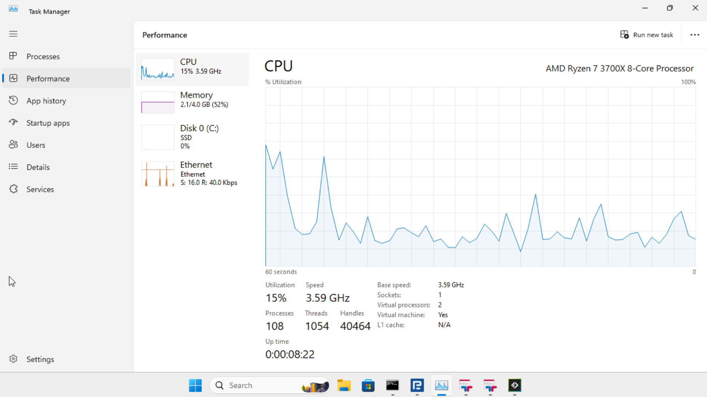

# Installation and configuration without mystery bullshit

Everything that makes the Windows VM, MT5 terminals, accounts, and sidecars boot without turning the setup into an archaeological dig.

## Contents

- [Requirements](#requirements)
- [Configuration](#configuration)
- [Multi-VM deployments](multi-vm-setup.md)
- [Runtime operations](operations.md)

## Requirements

- Linux host with KVM enabled (`/dev/kvm`)
- Docker + Docker Compose
- ~20 GB disk (4 GB ISO + 11 GB VM + MT5 installs)
- 5 GB RAM (for the Windows VM)

The container ships with a `512M` memory limit and `5G` memswap limit — so the VM runs mostly on host swap. tiny11 + the debloat script idles at ~1.4 GB, MT5 + the Python API add a bit on top. For low-volume use (placing trades, polling positions, pulling small recent candle windows) this is fine — it's not latency-sensitive enough for swap to matter. noVNC is there so you can watch the installation progress; after that, forget the UI exists and just hit the REST API.

### When 512M is NOT enough

MT5 terminals cache every loaded chart in process RAM and never release it. The moment you start backfilling deep history (e.g. scraping all symbols × multiple timeframes × years of data) each terminal balloons to multi-GB. With a 512M container limit that all gets paged to host swap, Windows guest memory manager doesn't know the pages are on disk, processes appear unresponsive, and Windows starts trimming/killing them silently. The cmd.exe wrappers stay open but blank, the Python API processes are dead, and you get a hung tunnel.

If you're doing **heavy historical data scraping**, do at least one of:

- Bump the container memory limit to match real demand (4–8 GB for multi-terminal heavy scraping).
- Scrape one broker at a time (stop the others) so only one terminal accumulates cache.
- Restart the terminal between batches via `POST /terminal/restart` to flush the chart cache.
- Chunk time ranges instead of pulling 10 years of M1 in one shot.

Or just run MT5 on a dedicated box if you're hammering it.

### Real-world usage: 4 terminals on 2 vCPUs + 512M RAM (light load only)



4 MT5 terminals (RoboForex, 2x TeleTrade, FTMO) running simultaneously on 2 vCPUs with only 512M real RAM. CPU spikes to 100% during startup, drops to ~15% idle. Total memory usage: 2.1 GB, comfortably on swap. This works **as long as you're not stress-loading it with deep history scrapes** — at idle / light polling, you can pack 10+ terminals in here.

## Configuration

### `config/config.yaml`

This gitignored file controls the whole contraption. Copy `config/config.yaml.example`, edit it, and do not commit your fucking broker password.

```yaml
# Bearer token for API auth. Empty = no auth.
api_token: "paste-the-output-of-openssl-rand-hex-32-here"

# VM auto-reboot every N minutes (flushes DWM/VirtIO-GPU state). 0 = disable.
reboot_interval: 30

# Default Strategy Tester timeout. POST /backtest can override per job.
backtest_timeout: "6h"

# Technical-analysis sidecar reached from inside the Windows VM.
wickworks:
  url: "http://20.20.20.1:8000/"
  timeout: "30s"

tailscale:
  auth_key: ""       # tskey-auth-... — empty disables the tailscale sidecar
  login_server: ""   # Headscale URL; empty = Tailscale cloud

# Extra pip packages for the VM. MetaTrader5/flask/waitress/flask-compress are always installed.
requirements: []

# Broker credentials, organized by broker → account_name.
accounts:
  roboforex:
    main:
      login: 12345678
      server: "RoboForex-Pro"
      password: "your_password"
    demo:
      login: 87654321
      server: "RoboForex-Demo"
      password: "demo_password"

# Terminal instances — one MT5 process + one API process per entry.
terminals:
  - broker: roboforex
    account: main
    port: 6542
    utc_offset: "3h"
    symbol_suffix: ""
  - broker: roboforex
    account: demo
    port: 6543
    utc_offset: "3h"
    symbol_suffix: ""
  - broker: roboforex
    account: tester
    port: 6544
    utc_offset: "3h"
    mode: backtest    # don't auto-launch terminal64.exe; reserved for /backtest jobs
    symbol_suffix: ".r"  # optional explicit suffix for tester symbol remap
```

Per-field notes:

- **`api_token`** — if set, every endpoint requires `Authorization: Bearer <token>`. Empty = open. Generate with `openssl rand -hex 32`.
- **`reboot_interval`** — minutes between scheduled VM reboots. `0` disables.
- **`backtest_timeout`** — default Strategy Tester timeout for `POST /backtest`. Accepts the same duration grammar as `utc_offset`: `"6h"`, `"30m"`, `"3h30m"`, `"90m"`, or a bare number interpreted as hours. Per-request form field `timeout` overrides it.
- **`wickworks.url`** — technical-analysis sidecar URL as seen from inside the Windows VM. The default reaches the sidecar sharing the MT5 container's network namespace; override it only when changing that network topology. `WICKWORKS_URL` overrides the file at runtime.
- **`wickworks.timeout`** — sidecar request timeout as a duration. Defaults to `"30s"`; `WICKWORKS_TIMEOUT` overrides the file at runtime.
- **`tailscale.auth_key`** / **`tailscale.login_server`** — see [Tailscale](operations.md#tailscale-optional). Empty `auth_key` skips the sidecar.
- **`requirements`** — additional pip packages installed in the VM on every boot.
- **`accounts.<broker>.<account>`** — `broker` must match the installer name (`mt5setup-<broker>.exe`) and the `broker` field in `terminals[]`. `account` must match the `account` field in `terminals[]`.
- **`terminals[].port`** — container-internal port for this terminal's HTTP API. Only nginx and the mt5 container talk to it; not exposed to the host.
- **`terminals[].instance`** — optional terminal clone name. Use this when the same `broker` / `account` appears more than once. There is no `queue` field in `config.yaml`; callers select a specific clone by routing requests to `/<broker>/<account>/<instance>/...`. Missing/empty = `default`, and that default instance also keeps the legacy `/<broker>/<account>/...` alias.
- **`terminals[].utc_offset`** — broker server's UTC offset, used to normalize all timestamps to real UTC on the wire (see [Broker time vs real UTC](rest-api.md#broker-time-vs-real-utc) below). Optional — defaults to `0`. Accepts `"3h"`, `"3h30m"`, `"-2h"`, `"90m"`, or a bare number (interpreted as hours). Common values: RoboForex/FTMO `"3h"`, TeleTrade `"2h"`.
- **`terminals[].mode`** — `live` (default) or `backtest`. `live` keeps `terminal64.exe` running so the MT5 SDK stays initialized for live trading endpoints. `backtest` prepares the same portable directory but does **not** launch `terminal64.exe`, leaving the data dir free for the Strategy Tester subprocess to grab — see [Backtest](backtesting.md#backtest-api). MT5 is single-instance per portable data dir, so a backtest cannot run against a `live` terminal.
- **`terminals[].symbol_suffix`** — optional explicit symbol suffix for Strategy Tester remaps. If set, mt5-httpapi appends it when `[Tester].Symbol` does not already end with that suffix. Examples: `"p"`, `".p"`, `"-mini"`. Use `""` for no suffix.
- **`terminals[].vm`** — optional VM name that this terminal runs on. Maps to a VM defined in `vms.yaml`. Absent → `default` (routes to the `mt5` container). See [Multi-VM Setup](multi-vm-setup.md) below.

Each terminal installs to `<broker>/base/` and gets copied to `<broker>/<account>/` at startup so multiple accounts of the same broker don't step on each other.

### `vms.yaml` (optional — multi-VM deployments)

When one Windows VM can no longer carry all your terminal bullshit, define the topology in `vms.yaml`. The file is **optional**: leave it out and the normal single-VM setup keeps working.

Each VM entry names its Compose service/container and defines its CPU, memory,
disk, storage, log, noVNC, and optional Wickworks settings. Each terminal then
selects a VM with `terminals[].vm`; terminals without that field route to the
default `mt5` container.

See the [multi-VM setup guide](multi-vm-setup.md) for the authoritative example,
complete field table, NUMA pinning, hot-tier bind mounts, generated files, and
compose-generation workflow.

### `config/setup.bat`

Custom commands that run on every VM boot before MT5 starts. Shove whatever Windows setup shit you need in here.

### `mt5installers/`

Dump your broker MT5 installers here. Name them `mt5setup-<broker>.exe` and each one gets its own portable install automatically.
